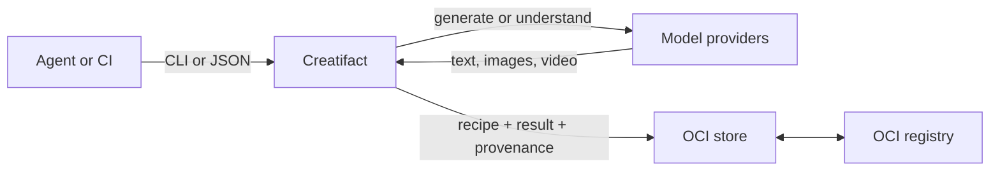

# Creatifact

**Build, version, and distribute AI generation workflows as portable OCI artifacts.**

Creatifact turns model calls into durable artifacts. It gives agents and CI a
stable CLI and JSON interface for generating text, images, and video, then
packages the recipe, inputs, outputs, and provenance into content-addressed
[OCI artifacts](https://github.com/opencontainers/image-spec/blob/main/image-layout.md).
Push them to any OCI-compatible registry. No Docker daemon is required.



Creatifact is useful when a generated asset must outlive the model call that
created it:

- **Durable results** — download expiring provider URLs into self-contained packages.
- **Traceable provenance** — retain effective prompts, model settings, usage, timestamps, and source references.
- **Reusable workflows** — package a generation recipe once and run it with new inputs anywhere.
- **Cost-aware orchestration** — execute DAG stages concurrently and reuse stages whose resolved inputs have not changed.
- **Provider independence** — use one task-oriented contract across built-in and third-party providers.

## Install

Creatifact requires Node.js 20 or Node.js 22+.

```bash
npm install -g creatifact
```

Or run it without installing:

```bash
npx creatifact --version
```

## Quick start

Set credentials for a built-in provider and choose it as the default:

```bash
export ZHIPU_API_KEY="..."
creatifact config set defaults.gen.provider zhipu
```

Generate an image and store it as an OCI package:

```bash
creatifact generate text2image "a paper crane in the rain" \
  --tag demo/crane:v1
```

The command returns one machine-readable JSON document on stdout:

```json
{"ok":true,"kind":"generate","data":{"task":"text2image","provider":"zhipu","model":"cogview-4","capability":"image.generate","artifacts":[{"url":"https://..."}],"tag":"demo/crane:v1","outputDir":"...","digest":"sha256:..."}}
```

Inspect the local store:

```bash
creatifact package ls
```

To publish the same package, give it a registry-qualified tag and push it:

```bash
creatifact tag demo/crane:v1 ghcr.io/acme/crane:v1
creatifact auth login ghcr.io
creatifact push ghcr.io/acme/crane:v1
```

Another machine or agent can retrieve the exact package:

```bash
creatifact pull ghcr.io/acme/crane:v1
creatifact package ls
```

## Core workflows

### Generate directly

Creatifact exposes model capabilities as tasks instead of provider-specific API
shapes. `gen` is an alias for `generate`.

| Task | Input | Output | Common options |
|---|---|---|---|
| `text2text` | prompt | text | `--system`, `--opt` |
| `image2text` | image and question | text | `--input` |
| `video2text` | video and question | text | `--input` |
| `text2image` | prompt | image | `--opt` |
| `image2image` | image and prompt | image | `--image`, `--opt` |
| `text2video` | prompt | video | `--no-wait`, `--timeout`, `--interval` |
| `image2video` | image and prompt | video | `--image` |
| `frames2video` | first frame, last frame, prompt | video | `--first-frame`, `--last-frame` |
| `embed` | text | vectors | positional inputs or `--input` |
| `resume` | saved video job handle | video | `--timeout`, `--interval` |

Examples:

```bash
# Select a provider explicitly
creatifact generate text2image zhipu "a paper crane"

# Select a provider and model
creatifact generate image2video kling/kling-3.0-turbo "animate" \
  --image first.png

# Let the configured default provider choose a suitable model
creatifact generate text2text "explain content-addressed storage"

# Submit an asynchronous video job and resume it later
creatifact generate text2video ark "a paper crane taking flight" --no-wait
creatifact generate resume '{"providerId":"ark","id":"..."}'
```

Run `creatifact models` to list providers and `creatifact models <provider>` to
see verified models and their supported tasks. Model discovery does not require
credentials.

Generation options use `--opt key=value`. Values are parsed as JSON when
possible, so `--opt steps=30` produces a number and `--opt watermark=false`
produces a boolean. Long prompts can live in a file: `--prompt-file <path>`
reads and trims the file's content (mutually exclusive with `--prompt` and the
positional prompt).

### Package a reusable recipe

A build manifest can contain a `gen` instruction. This packages model defaults,
prompts, and input assets into a portable recipe; credentials are never stored
in the package.

```jsonc
// creatifact.json
{
  "$schema": "https://raw.githubusercontent.com/unfallenwill/creatifact/main/schemas/creatifact-build.schema.json",
  "assets": "./assets",
  "gen": {
    "task": "image2image",
    "provider": "zhipu",
    "model": "cogview-4",
    "prompt": "editorial illustration",
    "images": ["pkg://references/source.png"],
    "options": { "size": "1024x1024" }
  }
}
```

Build the recipe without calling the provider, then run it with an override:

```bash
creatifact build --bake -t ghcr.io/acme/editorial:v1
creatifact push ghcr.io/acme/editorial:v1

creatifact generate ghcr.io/acme/editorial:v1 \
  "editorial illustration in red and black"
```

Long prompts can stay in their own files: set `gen.promptFile` to a path
relative to the manifest (mutually exclusive with `gen.prompt`). The file is
read and trimmed at load time — the inlined prompt drives fingerprints and the
packaged recipe, so built artifacts never reference the file again and prompt
edits re-run exactly the stages that consume them.

Without `--bake`, `build` executes the `gen` instruction once and packages the
result. Running `creatifact generate <ref>` behaves more like running an image:
it reads the packaged recipe, applies CLI overrides, calls the provider, and
creates a fresh result.

`generate <ref>` accepts a registry reference, a local store tag, or a local OCI
layout. Scalar CLI values replace recipe values, arrays replace arrays, and
`--opt` merges individual keys.

### Orchestrate a build DAG

Use named `stages` for multi-step workflows. References such as
`${cat.tag}` and `${cat.digest}` create dependency edges automatically;
independent stages run concurrently.

```jsonc
// creatifact.json
{
  "stages": [
    {
      "name": "cat",
      "gen": { "task": "text2image", "provider": "zhipu", "prompt": "a cat" }
    },
    {
      "name": "dog",
      "gen": { "task": "text2image", "provider": "zhipu", "prompt": "a dog" }
    },
    {
      "name": "gallery",
      "copy": [
        { "from": "${cat.tag}", "paths": ["artifact-1.png"] },
        { "from": "${dog.tag}", "paths": ["artifact-1.png"] }
      ],
      "annotations": {
        "org.example.cat.digest": "${cat.digest}",
        "org.example.dog.digest": "${dog.digest}"
      }
    }
  ]
}
```

```bash
creatifact build -t demo/gallery:v1
```

Each stage is a mini build with optional `from`, `copy`, `assets`, `gen`, and
`annotations` fields. The last stage is also tagged with the build's `-t`
reference. A stage may reference these outputs from an earlier stage:

- `tag`, `digest`, and `outputDir`
- `text` for text generation and understanding tasks
- `vectors` and `dimensions` for embeddings
- `artifacts[N].url` and `artifacts[N].base64` for media

The default concurrency is 4. Set `defaults.build.concurrency` to a positive
integer, or to `0` for unlimited concurrency.

### Reuse unchanged stages

Before execution, Creatifact fingerprints each stage's resolved inputs: its
generation spec, referenced values, source digests, and asset tree. On the next
build, unchanged stages are loaded from the content store without another model
call.

```bash
# See what would execute or be reused; writes nothing and calls no provider
creatifact build -t demo/gallery:v1 --plan

# Ignore previous fingerprints for this run
creatifact build -t demo/gallery:v1 --force
```

Reuse defaults to `"stale"`. Set `defaults.build.reuse` to `"never"` to always
execute. Standalone `--output` builds have no previous store entry to compare
and therefore run fully.

Incremental reuse is deliberately a policy, not a claim of deterministic model
output. Creatifact does not detect silent provider-side model changes, model
default changes, or a mutable remote tag moving to a new digest.

## Agent and CI interface

### JSON request files

Primary execution and configuration commands also have a JSON form. The
`command` value mirrors the subcommand tree and the remaining fields mirror its
arguments. Supported values include `generate.*`, `build`, `push`, `pull`,
`auth.*`, `config.*`, and `models`.

```json
{
  "$schema": "https://raw.githubusercontent.com/unfallenwill/creatifact/main/schemas/creatifact-request.schema.json",
  "command": "generate.text2image",
  "provider": "zhipu",
  "prompt": "a paper crane",
  "options": { "size": "1024x1024" },
  "tag": "demo/crane:v1"
}
```

```bash
creatifact -f request.json
```

For `generate.*` requests, trailing CLI flags override file values:

```bash
creatifact -f request.json --prompt "a red paper crane" --opt size=2048x2048
```

A request file represents one command. Multi-step orchestration belongs in a
build manifest under `stages`.

### Output contract

Every non-meta command emits exactly one JSON document:

- Success envelopes go to stdout.
- Progress and warnings go to stderr.
- On failure, the last non-empty stderr line is the error envelope and the
  process exits non-zero.
- `--pretty` indents JSON; piped output remains plain JSON.
- `--help`, `--version`, and a bare invocation remain human-readable.

```json
{"ok":false,"kind":"generate","error":{"code":"E_PROVIDER","message":"...","details":{"category":"quota","status":429}}}
```

| Code | Exit | Meaning |
|---|---:|---|
| `E_INTERNAL` | 1 | unclassified internal error |
| `E_USAGE` | 2 | invalid command, arguments, request fields, or local inputs |
| `E_CONFIG` | 3 | invalid or unreadable configuration |
| `E_AUTH` | 4 | missing or invalid credentials |
| `E_NETWORK` | 5 | connection or transport failure |
| `E_PROVIDER` | 6 | provider rejection or failure |
| `E_IO` | 7 | filesystem failure |
| `E_TIMEOUT` | 8 | polling timeout; details include the resumable handle |

## Packages and registries

Creatifact keeps built, pulled, and generated packages in one shared OCI layout
at `~/.creatifact/store`. Blobs are deduplicated by digest and tags are movable
pointers, similar to a local container image store.

```bash
creatifact package ls
creatifact tag demo/crane:v1 demo/crane:latest
creatifact package rm demo/crane:v1
```

Removing a tag deletes blobs only when no other tag references them.

Registry commands operate on the shared store by default:

```bash
creatifact auth login registry.example.com
creatifact push registry.example.com/team/crane:v1
creatifact pull registry.example.com/team/crane:v1
```

Use `--output <dir>` to export a standalone OCI layout and `--layout <dir>` to
push one. Registry credentials resolve in this order:

1. A complete CLI username/password pair
2. Credentials saved by `creatifact auth login`
3. Anonymous access

Use `--password-stdin` instead of putting secrets in shell history. Saved
credentials use the Docker-compatible `auths` shape in the Creatifact config.
`--plain-http` enables HTTP for a command; loopback registries use HTTP by
default, and `auths.<registry>.insecure` persists that choice per registry.

Bare references use `defaults.registry`, which defaults to `localhost:5000`.

## Build manifest reference

`creatifact build` reads `creatifact.json` from the working directory by
default; `-f <path>` points at any other manifest. A single-package
manifest supports these fields:

| Field | Description |
|---|---|
| `annotations` | OCI manifest annotations |
| `from` | One or more registry refs or local OCI layouts whose layers are inherited |
| `copy` | Selected files or subtrees extracted from source packages into new layers |
| `assets` | Local directory packed as the top layer, relative to the manifest |
| `gen` | Generation recipe or build-time generation instruction |

```json
{
  "$schema": "https://raw.githubusercontent.com/unfallenwill/creatifact/main/schemas/creatifact-build.schema.json",
  "annotations": { "org.opencontainers.image.title": "creative-runtime" },
  "from": ["registry.example.com/base/assets:v1"],
  "copy": [
    { "from": "registry.example.com/team/fonts:v2", "paths": ["fonts"] }
  ],
  "assets": "./project"
}
```

Layer order is `from` → `copy` → `assets`. Relative paths are resolved from the
manifest directory. Copy operations preserve OCI whiteout semantics.

Manifests and `-f` request files are parsed as JSONC: `//` and `/* */` comments
and trailing commas are accepted, so the examples above work verbatim.

Useful build options:

```text
-t, --tag <ref>        Required output tag
-f, --file <path>      Manifest path
    --dir <path>       Override the manifest's assets directory
-o, --output <dir>     Export a standalone OCI layout
    --annotation k=v   Add or override an annotation
    --plan             Print the dry-run execution plan
    --bake             Package a recipe without executing it
    --force            Disable incremental reuse for this run
```

For editor completion, keep the `$schema` property shown above or associate the
local schema in VS Code:

```json
{
  "json.schemas": [
    {
      "fileMatch": ["creatifact.json"],
      "url": "./schemas/creatifact-build.schema.json"
    }
  ]
}
```

## Providers and models

Built-in providers:

| Provider | Credentials |
|---|---|
| Ark | `ARK_API_KEY` |
| Kling | `KLING_API_KEY`, or `KLING_ACCESS_KEY` and `KLING_SECRET_KEY` |
| MiniMax | `MINIMAX_API_KEY` |
| Zhipu | `ZHIPU_API_KEY` or `BIGMODEL_API_KEY` |

Credentials may also be stored under `providers.<id>` in the config. Whole
string environment references are resolved at call time, so this keeps the
secret outside the file:

```bash
creatifact config set providers.zhipu.apiKey '${ZHIPU_API_KEY}'
```

Use the model catalog before constructing a command:

```bash
creatifact models
creatifact models zhipu
creatifact generate frames2video zhipu --list-models
```

### Custom models

Add or override provider models under `models.<providerId>`. This is useful when
a provider releases a model before Creatifact's verified registry is updated.

```json
{
  "models": {
    "minimax": [
      {
        "id": "MiniMax-H4",
        "mode": "v2",
        "capabilities": {
          "video.generate": { "textOnly": false, "firstFrame": true }
        }
      }
    ]
  }
}
```

Unknown model IDs are appended and known IDs are shallowly overridden. Numeric
constraints in model notes are hints; the provider API remains authoritative.

### Provider plugins

Declare a third-party provider module under `providers.<id>.module`:

```json
{
  "providers": {
    "my-provider": {
      "module": "creatifact-my-provider",
      "apiKey": "${MY_PROVIDER_API_KEY}"
    }
  }
}
```

The module must default-export a factory that returns a `Provider`. Bare package
names, relative paths, absolute paths, and `~/...` paths are supported.

```ts
import {
  createJsonClient,
  defineProvider,
  type Provider,
} from "creatifact/providers"

interface Settings {
  apiKey?: string
}

export default defineProvider((settings: Settings, env) => {
  const apiKey = settings.apiKey ?? env["MY_PROVIDER_API_KEY"]
  if (!apiKey) throw new Error("missing MY_PROVIDER_API_KEY")

  const client = createJsonClient({
    baseUrl: "https://api.example.com",
    headers: { authorization: `Bearer ${apiKey}` },
  })

  const provider: Provider = {
    id: "my-provider",
    models: [
      {
        id: "my-image-model",
        capabilities: { "image.generate": {} },
        lastVerified: "2026-08",
      },
    ],
    defaultModels: { "image.generate": "my-image-model" },
    imageGenerate: {
      async create(req) {
        const result = await client.post<{ url: string }>("/v1/images", req)
        if (result.isErr()) throw result.error
        return { artifacts: [{ url: result.value.url }] }
      },
    },
  }

  return provider
})
```

Plugin types and helpers are exported from `creatifact/providers`. Add
`creatifact` as a development dependency to compile a plugin; the CLI loads the
module at runtime.

## Configuration

The default config path is `~/.creatifact/config.json`. Override its directory
with `CREATIFACT_CONFIG_DIR` or pass `--config-dir <dir>` to any command.

```json
{
  "defaults": {
    "registry": "ghcr.io",
    "gen": { "provider": "zhipu" },
    "build": { "concurrency": 4, "reuse": "stale" }
  },
  "providers": {
    "zhipu": { "apiKey": "${ZHIPU_API_KEY}" }
  }
}
```

Manage it through the CLI:

```bash
creatifact config path
creatifact config list
creatifact config get defaults.gen.provider
creatifact config set defaults.gen.provider zhipu
creatifact config reset
```

Secret-looking values are masked by `config list` and `config get`. Config
writes are atomic, and a corrupt file fails loudly instead of being ignored.

## Artifact semantics

A generated package contains the effective generation spec and result metadata.
Media artifacts are downloaded into a layer when possible so the package does
not depend on an expiring CDN URL; the original URL remains in metadata for
provenance. If the URL is already unavailable, Creatifact preserves a URL-only
record and emits a warning.

Text and embedding tasks return `data.text` or `data.vectors` directly. Pass
`--tag` or `--output` to package them as `text.txt` or `vectors.json`, which can
then be consumed through `pkg://` references in another recipe.

Creatifact provides immutable bytes, recorded inputs, and traceable lineage. It
does not promise that rerunning a stochastic or silently updated model will
produce identical bytes.

## Development

```bash
npm run dev          # Run src/index.ts directly
npm run typecheck    # Strict TypeScript check
npm run gen:schemas  # Regenerate schemas from src/contract.ts
npm run build        # Bundle the CLI
npm test             # Run Vitest once
npm run qa           # Typecheck, build, test, lint, dependency check, smoke test
```

`src/contract.ts` is the single source of truth for request and build schemas.

## License

[MIT](LICENSE)
